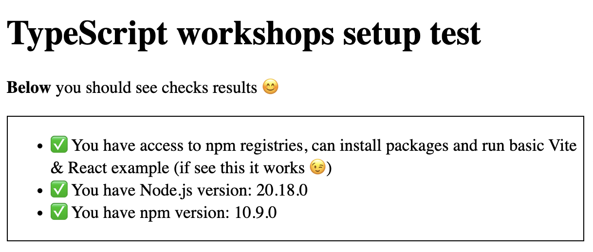

# TypeScript workshops setup test

If you're reading this, you're probably preparing for TypeScript workshops with me.

Thats me --> 🧑‍💻 [michalczukm.xyz](https://michalczukm.xyz)

I am more than happy about it 😊

⚠️ Please do below setup check **before workshops** to make sure you have environment ready for workshops.

In will save us time on firefighting with environment setup on the beginning of our workshops 🙇

## Prepare your machine

You'll gonna need **one of currently supported LTS versions** of

- node.js (it should be written on main page of [nodejs.org](https://nodejs.org/en/))
- npm (if you have node.js LTS, you also should have up to date `npm` version)

If not specified otherwise in preparation docs you should receive before workshops.

### Install node.js & npm if needed

I recommend you to use `nvm` for this, but below you have all options:

- Node.js
  - (❇️ recommended) [nvm - Node Version Manager for UNIX sytems](https://github.com/nvm-sh/nvm)
  - [nvm-windows - Node Version Manager for Windows](https://github.com/coreybutler/nvm-windows)
  - [Install globally build from Node.js](https://nodejs.org/en/)
- npm
  - Should be already installed with Node.js (no matter how you installed Node.js)

## Check your environment

Steps

1. Clone the repo on your local machine `git clone https://github.com/michalczukm/typescript-workshops-setup-test.git`
2. Navigate to `typescript-workshops-setup-test` with `cd typescript-workshops-setup-test` in your terminal
3. Install dependencies with `npm ci`
4. Run `npm start`

You should see output similar to the one below (with info about `node.js` setup being legit 🤞)

```shell
➜  typescript-workshops-setup-test git:(main) npm start

> typescript-workshops-setup-test@1.0.0 start
> tsx node-test.ts && vite serve --open

✅ Node.js setup looks legit

  VITE v5.4.8  ready in 81 ms

  ➜  Local:   http://localhost:5173/
  ➜  Network: use --host to expose
  ➜  press h + enter to show help
```

And your default browser should display page with checks results.
If everything is fine, you should see page as below

> [!IMPORTANT]  
> Unless specified elsewhere - we won't use very node.js specific features during workshops, so you can use any LTS version of node.js & npm.
>
> But - it's good to have it up to date :)


